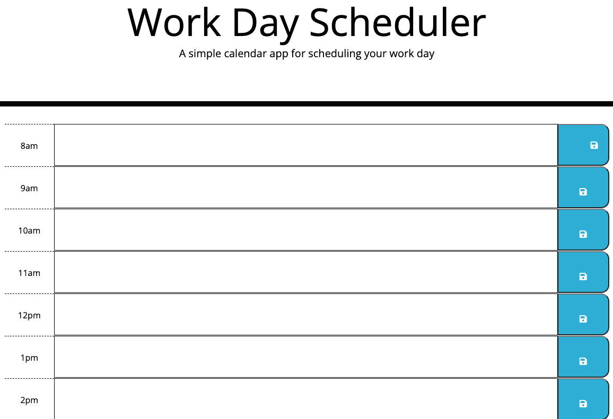
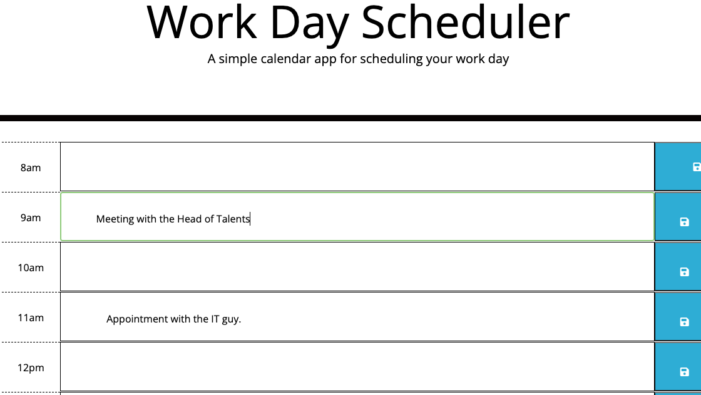

# WorkDay-5

## Description
For my project, I am creating a very simple calender aplication that will allow other users to save events every hour of the day. My app will be ran by HTML and CSS while mainly using jQuery. I willbe using a little of Javascript as well to help structure some parts of my application.

## Visuals

## Author and Acknowledgment

I would like to thank my instructors for guidling me to figuring out some of the coding I needed to understand to better present my app.

 

README is maintained by [Jeremiah](https://github.com/Jwarren619) , followed by the [WorkDay-5](https://jwarren619.github.io/WorkDay-5/) and hosted on [GitHub](https://github.com/Jwarren619/WorkDay-5).